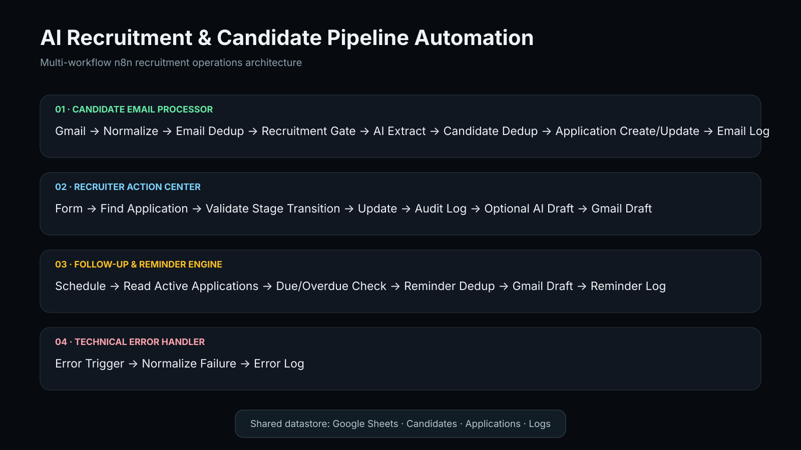

# AI Recruitment & Candidate Pipeline Automation

[Portfolio](https://mbriciaportfolio.vercel.app/) · Built with n8n, OpenAI, Gmail, Google Sheets, and JavaScript




A portfolio-ready n8n recruitment operations system that combines AI interpretation with deterministic business rules, human-controlled hiring decisions, duplicate protection, reminders, audit logs, and centralized technical error handling.

## What the system does

The project is designed as four cooperating n8n workflows sharing one recruitment datastore:

1. **Candidate Email Processor** — receives incoming candidate emails, filters obvious non-recruitment messages, uses AI for interpretation/extraction, prevents duplicate email/candidate/application records, and creates or updates the candidate pipeline.
2. **Recruiter Action Center** — lets a recruiter submit controlled actions such as Shortlist, Schedule Interview, Assessment, Offer, Reject, Hire, Put On Hold, and Close. Stage transitions are validated before updates.
3. **Follow-up & Reminder Engine** — checks active applications on a schedule, identifies due/overdue recruiter actions, prevents same-day duplicate reminders, creates recruiter reminder drafts, and logs them.
4. **Technical Error Handler** — captures automatic workflow failures and writes normalized diagnostic records to the shared error log.

## Design principle

**AI interprets; business logic decides.**

AI is used where language understanding is useful:
- recruitment email interpretation
- structured candidate/application extraction
- candidate-facing email draft generation

Deterministic logic controls:
- duplicate detection
- candidate/application matching
- stage transitions
- recruiter actions
- due/overdue checks
- reminder deduplication
- logging and error handling

## Workflow 1 — Candidate Email Processor

```text
Gmail Trigger
→ Get Full Email
→ Normalize
→ Email Dedup Check
→ Recruitment Keyword Gate
→ AI Interpretation / Extraction
→ Candidate-Pipeline Route
→ Candidate Lookup
→ Create Candidate if New
→ Application Lookup
→ Create or Update Application
→ Email Log
```

### Workflow 1 safeguards
- exact Gmail message deduplication before AI processing
- normalized candidate email matching
- one candidate can have multiple applications
- candidate + job title application matching
- interview date extraction when explicitly present
- non-candidate/job-alert emails stop before database writes
- Google Sheets acts as a transparent demo datastore

## Shared Google Sheets tabs

- `Candidates`
- `Applications`
- `Email_Log`
- `Recruiter_Action_Log`
- `Communication_Log`
- `Reminder_Log`
- `Error_Log`

## Tested scenarios

- new candidate application
- non-candidate job alert ignored
- exact email duplicate blocked
- existing candidate detected
- existing application updated instead of duplicated
- interview confirmation and interview date extraction
- candidate withdrawal
- invalid recruiter action blocked by stage-transition rules
- shortlist / interview / offer / hire recruiter lifecycle
- AI-generated Gmail drafts for candidate communication
- due-today and overdue recruiter reminders
- same-day reminder deduplication
- invalid application ID validation error
- automatic technical failure captured by the central error workflow

## Workflow 2 — Recruiter Action Center

The recruiter-facing workflow starts from an internal n8n form and turns human decisions into controlled, auditable pipeline updates.

### Recruiter actions
- Shortlist
- Schedule Interview
- Assessment
- Offer
- Reject
- Hire
- Put On Hold
- Close

### Control flow

```text
Recruiter Form
→ Normalize Action
→ Find Application
→ Validate Application Exists
→ Validate Stage Transition
   ├─ blocked → Recruiter_Action_Log
   └─ allowed → Update Application
              → Log Successful Action
              → Email Draft Needed?
                 └─ yes → Find Candidate Contact
                        → Prepare Communication Context
                        → AI Draft
                        → Gmail Draft
                        → Communication_Log
```

The workflow also logs an invalid-application validation error instead of attempting a database update.

### Human-in-the-loop communication

Interview, assessment, offer, and rejection actions can create a Gmail **draft** for recruiter review. The AI prompt is constrained to the provided candidate, role, recruiter notes, dates, and recruiter name; it is instructed not to invent missing details or claim that the message was already sent.

## Workflow 3 — Follow-up & Reminder Engine

This scheduled workflow checks the recruitment pipeline each morning and creates recruiter reminder drafts only when follow-up is actually due.

### Control flow

```text
Daily Schedule
→ Read Applications
→ Active Application?
→ Follow-up Due?
→ Prepare Reminder
→ Find Today's Reminder
→ Already Reminded Today?
   ├─ yes → stop
   └─ no  → Restore Reminder Data
          → Create Gmail Draft
          → Log Reminder
```

### Reminder rules
- terminal stages `Rejected`, `Withdrawn`, `Hired`, and `Closed` are ignored
- a follow-up is due when `next_action_date` is today or earlier
- reminders are labeled **Due Today** or **Overdue**
- overdue days are calculated from the stored action date
- a reminder key combines `application_id` + current date
- that key prevents more than one reminder draft for the same application on the same day
- reminders are created as Gmail drafts for recruiter review rather than automatically sent

## Workflow 4 — Technical Error Handler

This centralized error workflow is linked to the production-style automatic executions of the other recruitment workflows.

### Control flow

```text
Error Trigger
→ Normalize Technical Error
→ Append Error_Log
```

### Captured fields
- generated technical error ID
- source workflow name
- error type
- failed / last executed node
- normalized error message
- execution ID
- execution URL
- timestamp

The handler accepts both execution-level and trigger-level error payloads so failures can still be recorded even when some execution metadata is unavailable.

## Portfolio evidence

Privacy-safe evidence reconstructed from the tested Gmail scenarios:

| Evidence | What it demonstrates |
| --- | --- |
| [Candidate application email](./evidence/candidate-application-email.svg) | Incoming unstructured application that Workflow 1 interprets and stores |
| [Interview invitation draft](./evidence/interview-invitation-draft.svg) | Recruiter-controlled interview action producing a reviewable candidate Gmail draft |
| [Offer draft](./evidence/offer-draft.svg) | Later-stage recruiter action producing a reviewable offer draft |
| [Overdue recruiter reminder](./evidence/overdue-recruiter-reminder.svg) | Scheduled follow-up workflow generating an internal overdue reminder draft |

The evidence uses synthetic candidate/recruiter data and preserves the behavior of the tested scenarios without exposing account-specific sender details.

## Public export status

Sanitized exports included:

- **Workflow 1 — Candidate Email Processor**
- **Workflow 2 — Recruiter Action Center**
- **Workflow 3 — Follow-up & Reminder Engine**
- **Workflow 4 — Technical Error Handler**

**Public workflow package complete: 4 / 4 sanitized exports.**

## Setup

### Required integrations
- Gmail OAuth2
- Google Sheets OAuth2
- OpenAI Chat Model

### Import notes
1. Import all four sanitized workflow JSON files into n8n.
2. Reconnect your own Gmail, Google Sheets, and OpenAI credentials.
3. Replace `YOUR_GOOGLE_SHEET_ID` with your own spreadsheet.
4. Confirm the expected sheet/tab names and column schemas.
5. Set the workflow timezone to the client/business timezone before activating the daily reminder schedule.
6. Link the Technical Error Handler as the Error Workflow for Workflows 1–3.
7. Publish/activate the trigger-based workflows only after credentials, sheet mappings, and test data have been verified.

Public exports are intentionally saved as inactive templates so an imported workflow cannot start processing mail or scheduled reminders before the new owner finishes configuration.

The public JSON intentionally excludes credential IDs, private spreadsheet IDs/URLs, instance IDs, webhook IDs, workflow IDs, and the linked error-workflow ID.

## Portability

The design uses standard n8n nodes and external-service credentials, so it can be moved from n8n Cloud to a self-hosted n8n instance or a client-owned environment by reconnecting credentials and data sources.

## Portfolio note

All public examples use synthetic candidate and recruiter information. No production candidate data is included.
